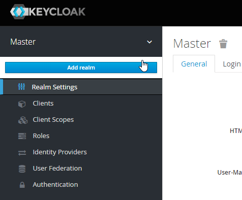
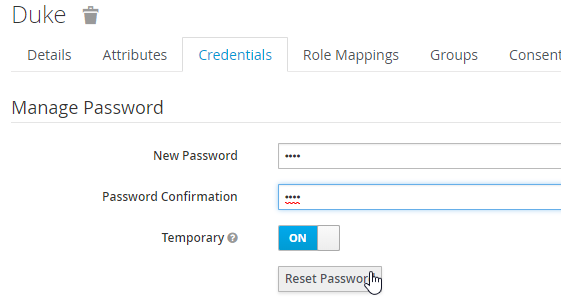
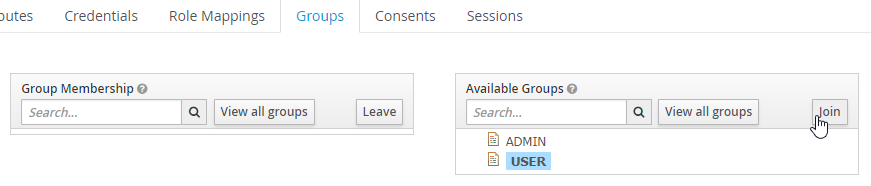
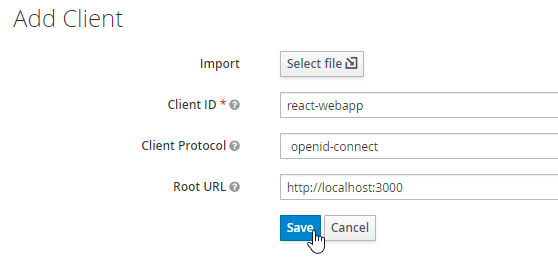
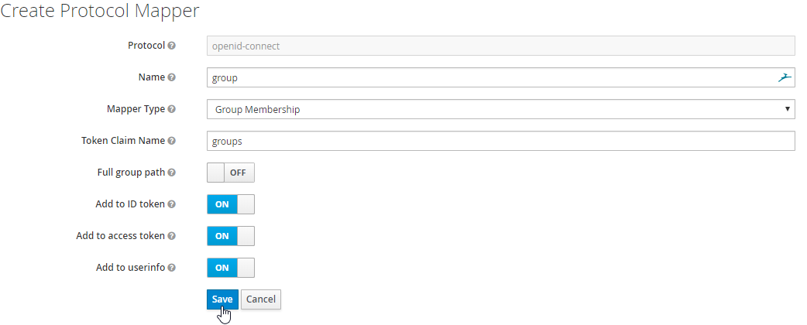
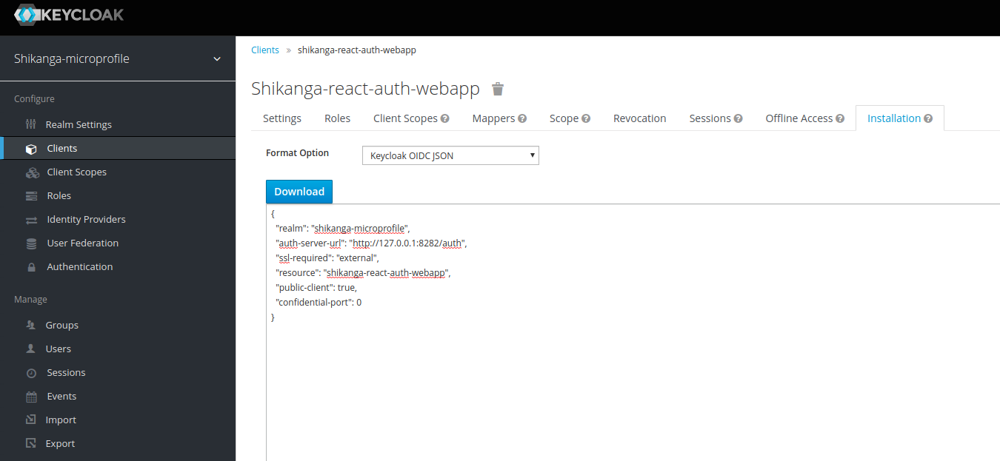

# shikanga-microprofile-auth-keycloak
An Eclipse MicroProfile based authentication implementation based on JWT, Keycloak, PostgresSQL and ReactJS

## Keycloak and PostgreSQL

The `keycloak/docker-compose-postgres.yml` template creates a volume for PostgreSQL and starts Keycloak connected to a PostgreSQL instance.

Run the example with the following command:

    `docker-compose -f ./keycloak/docker-compose-postgres.yml up`

Open http://localhost:8282/auth and login as user 'admin' with password 'admin'.

Note - If you run the example twice without removing the persisted volume there will be a warning 'user with username exists'. You can ignore this warning.

## Setting up Keycloak for JWT

First, we have to set up a new **realm**, which is a logical container for managing users, credentials, roles, and groups which are then isolated from other realms. 
At default, only the Master realm exists and to add a new one, you have to create a new in the admin panel at the top left (while hovering over the drop-down indicator):



On the following page add the name **`shikanga-microprofile`** and make sure the realm is enabled. Next, go to the **Keys** tab within the **Realm Settings** and copy the public key of the **rsa-generated** key to an editor or clipboard. 
We will need this key later on for **verifying** the JWT signature within our MicroProfile based backend micro-services.

To provide groups for the user, you have to first create some groups. Go to **Manage** -> **Groups** -> and click on **New** to add a group. Enter a group name e.g. **ADMIN** or **USER** and press **Save**. That’s all for adding a group.

As we won’t connect an Active Directory or LDAP, we have to set up at least one user manual. Go to **Users** (left-side menu) and click **Add User**. Enter a username and hit save. 
To add a password, go to the **Credentials** tab within the user and enter a password of your choice:



Within the user settings, you can switch to the tab **Groups** and select an available group and hit **Join** to add this user to the group.



## Add the React frontend as a client inside Keylcoak

Our frontend will, later on, manage the authentication with **Keycloak**. Therefore we have to make sure that Keycloak is aware of this application. 
Therefore Keycloak offers the concept of a **client**, which is an entity that can request Keycloak to authenticate a user. A new client can be added in the **Clients** section (left-side menu) in the admin panel within our realm. 
Click on **Add Client** and enter the client id **`shikanga-react-auth-webapp`**. Next, select **openid-connect** as the protocol and **http://localhost:3000** as the root URL:



As Keycloak per default won’t add the users’ group information to the **JWT**, we have to configure this. Within the client settings for **`shikanga-react-auth-webapp`**, go to the tab **Mappers** and create a new one. 
Select **Group Membership** as **Mapper Type**, enter `group` as **Name** and `groups` as **Token Claim Name**. Make sure to disable the **Full group path** switch. Otherwise we get a slash in front of the group name (e.g. /USER):



To configure the frontend for the Keycloak authentication we need the **Keycloak OIDC JSON**. We can obtain this at the tab **Installation** within our client.



That’s all for the **Keycloak** configuration. All your configured groups, roles and clients can be exported within the **Export** menu section.

## Starting the frontend React application

Run the following commands:
``` 
npm --prefix ./frontend/ install

npm --prefix ./frontend/ start
```

Visit http://localhost:3000 and login with any of your created users

## Building the MicroProfile backend application

1. ### payara-micro

```
 mvn -f ./backend-payara-micro/pom.xml clean package
```

This will create an executable jar file **shikanga-microprofile-auth-keycloak-microbundle.jar** within the _target_ maven folder. 
This can be started by executing the following command

```
java -jar ./backend-payara-micro/target/shikanga-microprofile-auth-keycloak-microbundle.jar --port 8180
```


